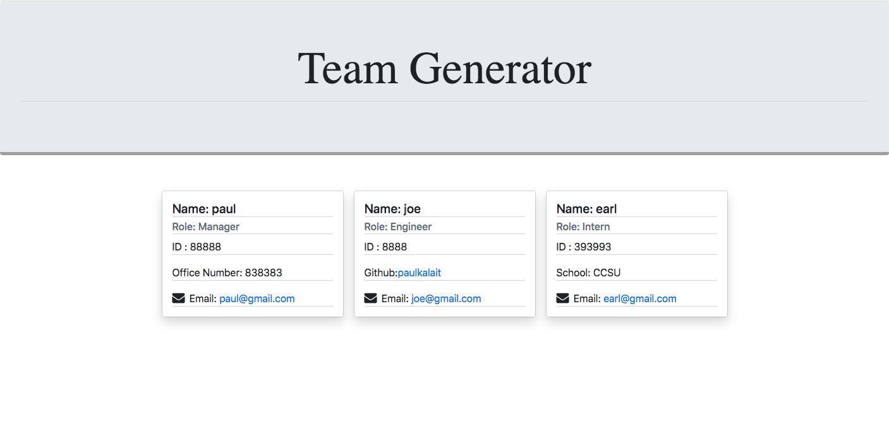
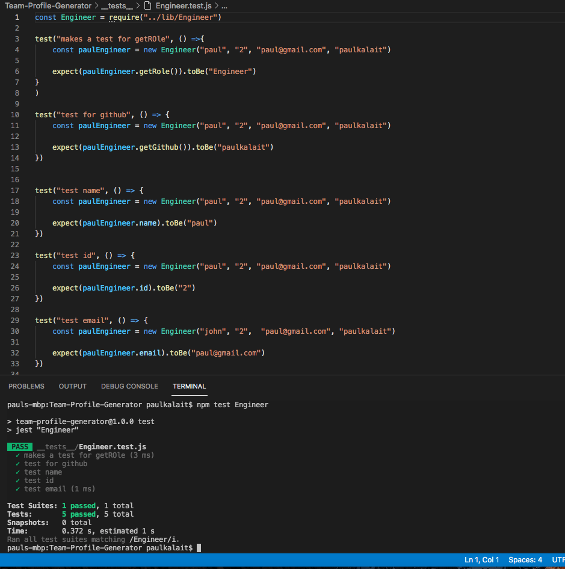
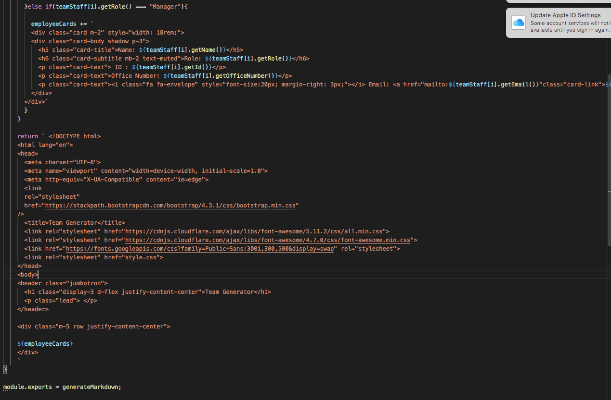

# Team-Profile-Generator

## Link to video:
https://www.youtube.com/watch?v=1hCZkjweDhA

## Purpose: 
This assignment was to create a generated web page that the user can create with the help of node, jest, and the inquirer module. The webpage displays cards for employee staffs (that are dynamically generated based off the user's input).

## Steps: 
1. I had to gain access to jest by installing it to the root directory of my repo, and installed the fs and inquirer using the require method. 

2. I created constructors for Employee, Engineer, Intern, and Manager. The Employee was the parent class. I then passed in the children classes values' using the super method + adding their special values that corresponds to their class. Here is a screenshot of the Intern class. 

    

    The Intern Class uses the super method to inherit the Employee parent constructor values + add a this.school that = school. The process for the other child classes are similar and then were exported into their test folders.

3. I created test files for each class to test their functions. These tests gave values to the getRole(), getName(), getId(), getSchool(), getOfficeNumber() functions . I used the npm test method to track my tests. The tests first must have failed, then were passed by writing logic, and then were refined. Here is a screen shot of the engineer test file: 

    

    the tests for all the values imported were passed successfully, giving the functions a meaning parameters values.

4. imported all of my classes into an index.js file holding all the necessary prompts to then be passed into a generatehtml.js file. I created prompt questions for the engineer, intern, and manager. The answers were pushed into an array. This array was then passed through into the generatehtml file.

5. the generatehtml contains the template literals holding bootstrap cards for the intern, engineer, and manager. the array is being forlooped and contains if and else if statements that are based off weather an intern, engineer, or manager card templates should be generated. then these cards are being added to a variable holding an emptystring called "employeeCards". the employeeCards variable is then pasted in the finale html template being returned at the bottom (which is also in template literals). Here is a screenshot of that process: 

    

    Above, you can see that the Manager card template is being added into that employeeCards variable. The manager card template holds the corresponding functions: getName(), getRole(), getOfficeNumber(), making them  dynamic values. The employeeCards was pasted into the div container in the html template being returned. 

## Resources that helped me: 
https://developer.mozilla.org/en-US/docs/Web/JavaScript/Reference/Classes/extends
https://developer.mozilla.org/en-US/docs/Web/JavaScript/Reference/Operators/super